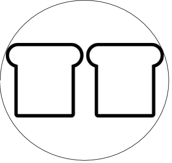
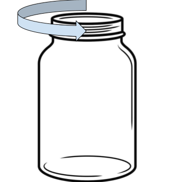
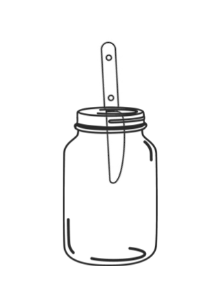
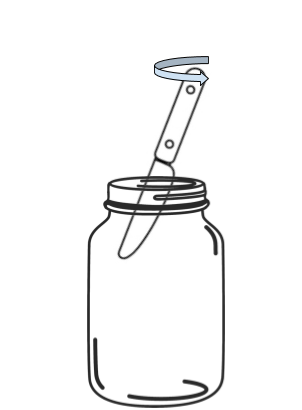
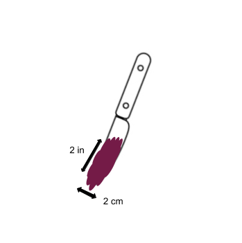
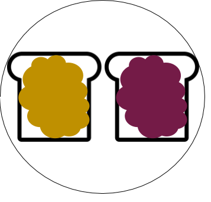

# How to Make a Peanut Butter & Jelly Sandwich

## Overview

This guide teaches absolute beginners how to make a peanut butter and jelly sandwich (PB&J).
There are many ways to prepare a PB&J; this article aims to describe the simplest, most accessible, and most standard method.

*Time*: 5 minutes

## Prerequisites

You will need the following ingredients to prepare a PB&J:

- Two (2) slices of pre-sliced bread
    - Pre-sliced bread will provide a smooth, flat surface for spreading the toppings.
    - The bread should be a mild variety like White or Whole Wheat. Avoid strong flavors like Rye or Sourdough for your first PB&J.
- Jam
    - Jam typically comes in a jar; this guide assumes you are using jam from a jar.
    - Common varieties of jam suitable for PB&Js include Strawberry, Blueberry, Raspberry, etc.
    - For the purpose of this guide, jam is interchangeable with jelly.
- Peanut butter
    - Peanut butter typically comes in a jar; this guide assumes you are using peanut butter from a jar.
    - Use Smooth peanut butter for your first PB&J, as it is easier to spread.

Along with the ingredients, you will need the right equipment and workspace:

- A sturdy countertop or table to work on
- Access to a sink
- A plate wide enough in diameter to accommodate two (2) slices of your bread
- A butter knife
- A paper towel

## Steps

**1.** Place each slice of bread on the plate.

**2.** Open the jar of jam by twisting the lid as shown in the figure below, lifting it off the jar once it is completely loose from the threads.
This is assuming a right-handed thread on the jar, which is standard. 

**3.** Pick up the butter knife by the handle and insert the blade about two (2) inches straight down into the jam through the open top of the jar.

**4.** Using your hand, tilt the handle of the knife at about a 20 degree angle to the surface of the jam, perpendicular to the flat side of the blade, so that the two inches of the blade that you inserted into the jam begins to scoop some of the jam.

**5.** From this position, lift the knife out of the jar by the handle. 
The flat side of the blade of the knife should scoop jam, approximately two (2) centimeters (cm) high.

**6.** Bring the knife to one (1) of the slices of bread, and turn it over so that the jam resting on the flat side of the blade is now facing the slice of bread. 
Some or all of the jam may fall from the knife to the bread at this point; that’s ok.

**7.** Bring the flat side of the blade down to the center of the slice of bread, so they are touching. 
Staying within the boundaries of the bread’s crust, spread the jam out by repeatedly wiping the knife face against the bread to move the jam around until the entire slice is reasonably evenly covered. 

**8.** Rinse the knife off in the sink and dry it with the paper towel.

**9.** Repeat steps 2-7 with the peanut butter instead of the jam, and on the other slice of bread. 

**10.** Once both slices of bread are covered with their respective topping, pick up one of the slices by sliding your fingers, palm facing upward, between the plate and the bread. 
Lift your hand to lift the slice, toppings facing upward. 
Do not touch the toppings.

**11.** Line the edge of the slice in your hand up to the edge of the slice still on the plate like adjacent pages in a book. 
In a swift movement, turn your hand over (from palm-facing-up to palm-facing-down) on top of the other slice, so that the slice in your hand lands toppings-side-down onto the other slice. 

**12.** The PB&J is assembled. 

## Summary

This guide taught you how to make a peanut butter and jelly sandwich, or PB&J. 
Now that you know the standard method of making a PB&J, you can experiment with different breads, jams, and peanut butters. Don’t forget to clean up!

## Additional resources

Consult other articles in our knowledge database for further help with the content in this guide:

- [How to open a jar]()
- [How to wash a knife]()
- [What is jam?]()
